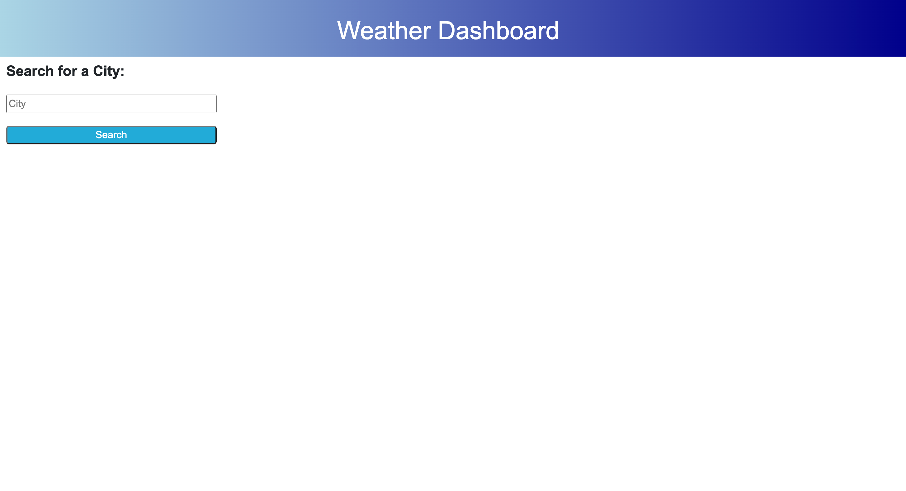
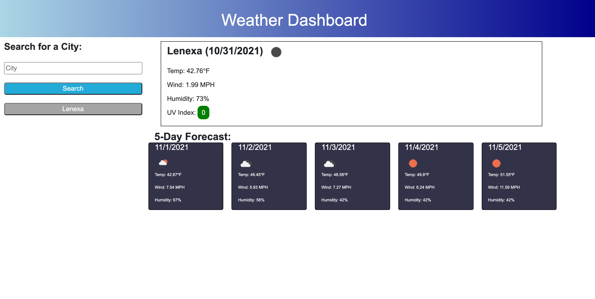
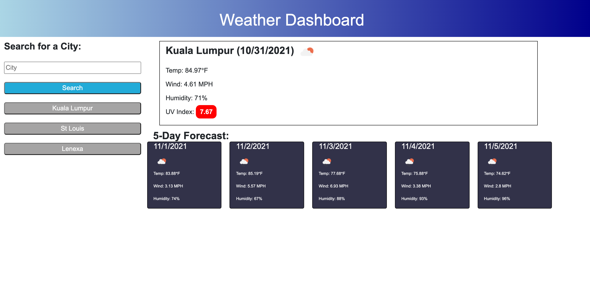
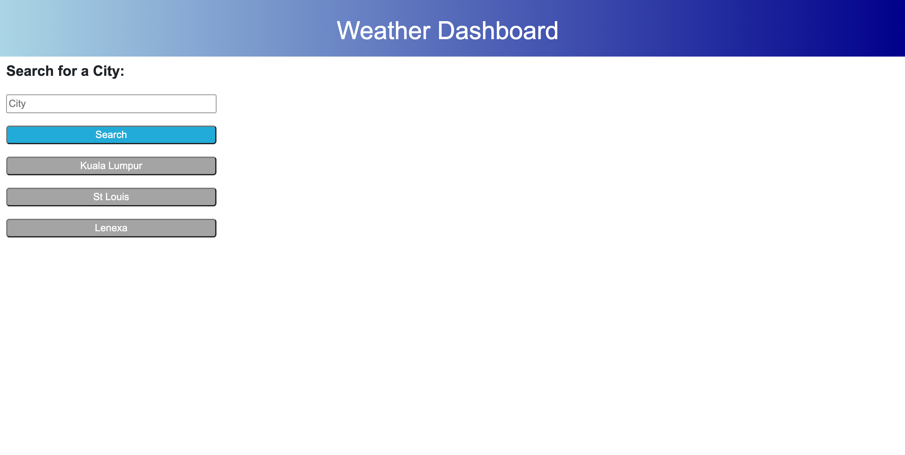

# WeatherDashboard-AdamField

## Description
User can search any city and the application will display the current weather with temperature, wind speed, humidity, and UV index. UV index is color coded based on EPA UV index scale. When you user searches a city it will be saved below the search box as a previous searched city. When the user searches a new city it will replace the last search and the city name will be added to the previous searches. The users previous searches will be persisted to localStorage so if the window is closed and reopened the previous searches will repopulate.

## Built With
* HTML
* CSS
* Bootstrap
* Javascript
* OpenWeather API

## Link to Application

https://adamjfield.github.io/WeatherDashboard-AdamField/

## Screen Shots
### Landing page example:

### Initial search example:

### Multiple search example:

### Reload of page for localStorage example:

